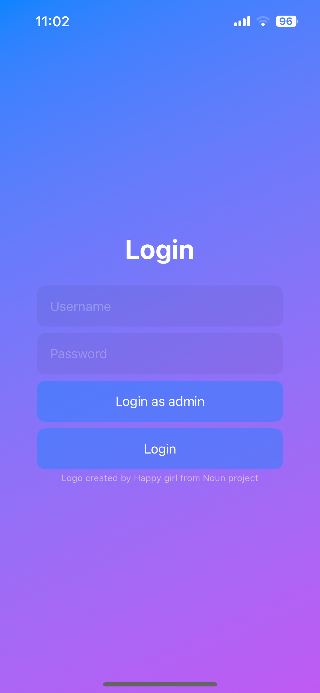
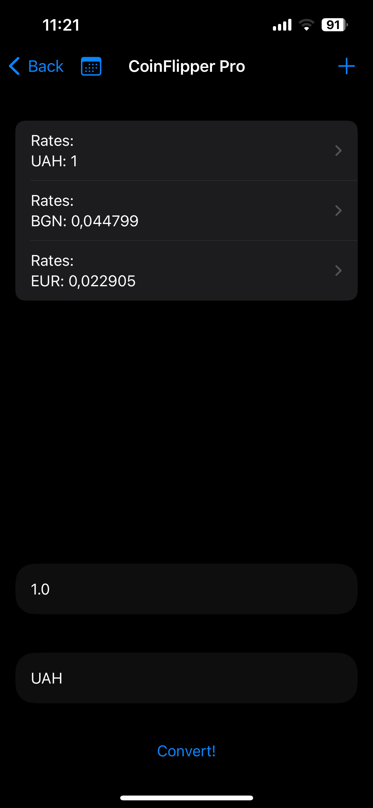
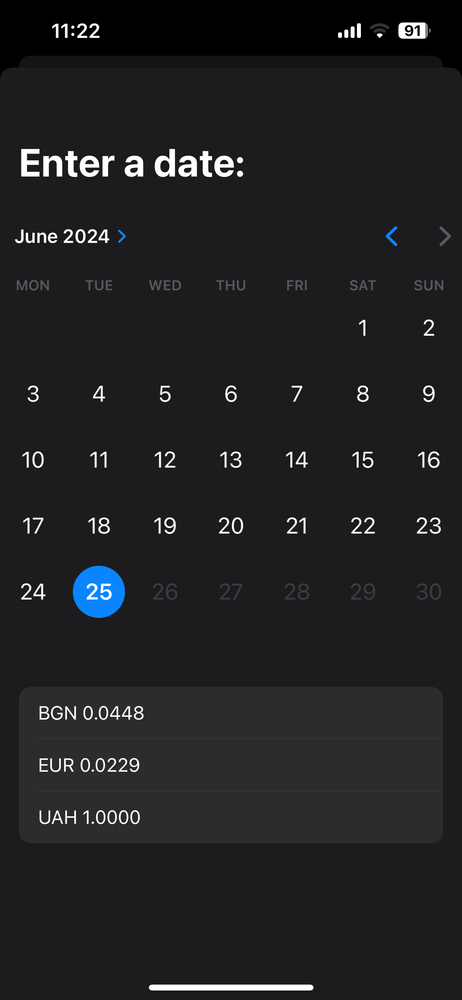
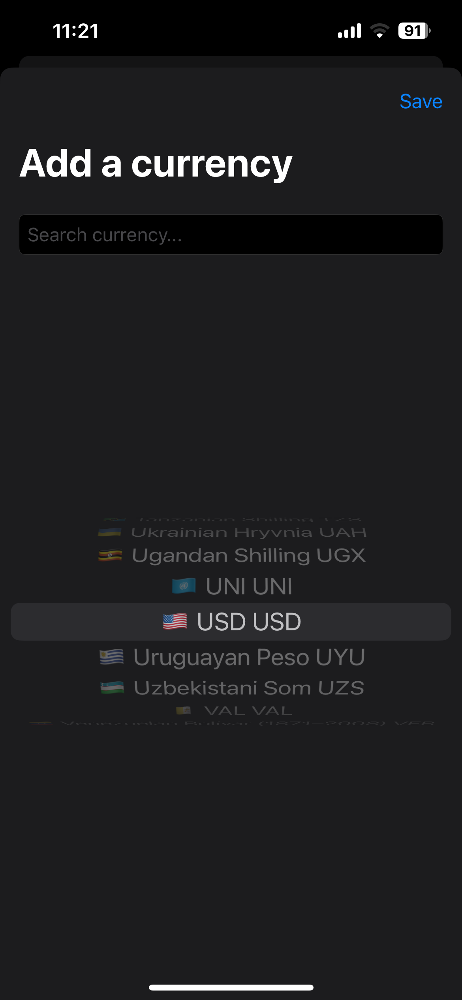

  
  <h1>CoinFlipper</h1>

### Currency Converter for iOS ###

This project is an currency converter app where you can check today's exchange rates and explore historical rates.
You can easily change the amount of money you want to convert or switch the base currency. The app supports 168 different currencies, including cryptocurrencies.

### Stack:
- Swift 5
- SwiftUI
- UserDefaults
- Design patterns
- Application lifecycle
- Local Authentication
- API
- MVVM

## App highlights ##
https://github.com/Quercy-tech/CoinFlipper/assets/68280745/abcb2607-77d4-4fa0-aa2b-d4bdd9183606

### Login screen ###

### Home screen ###

### Historical rates ###

### Add a currency with filter ###

### CoinFlipper, is a comprehensive currency converter designed for iOS users. Here’s what sets us apart:

 - Intuitive Interface: Navigate effortlessly through our app’s clean and minimalist design.
 - Currency Conversion: Check real-time and historical exchange rates for 168 currencies, including cryptocurrencies.
 - Customization: Tailor your experience with personalized settings like base currency selection and dark mode support.
CoinFlipper simplifies currency conversion while offering robust features and a seamless user experience.
